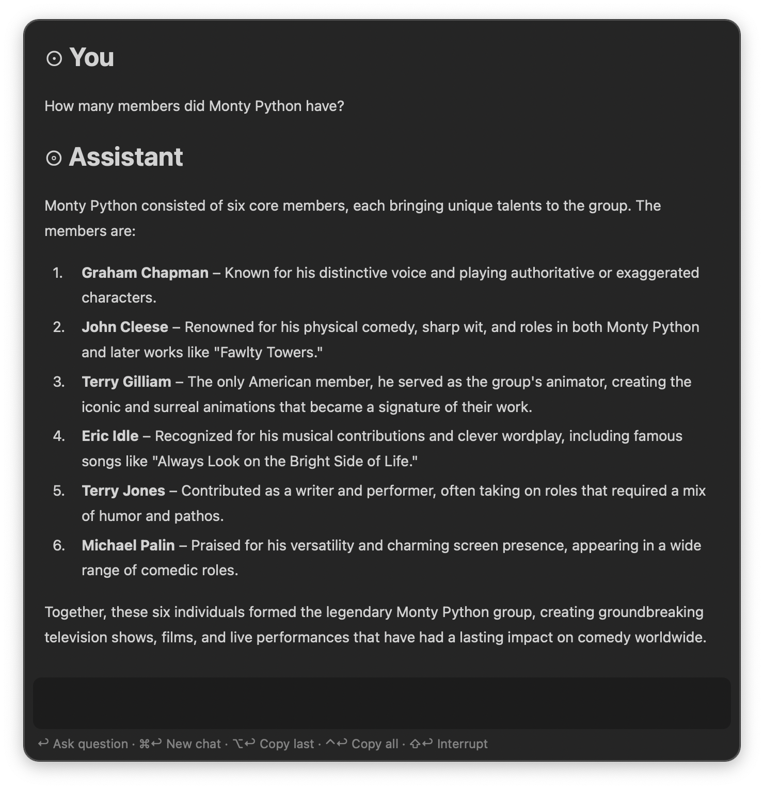

## Setup

1. Create an OpenAI account and [log in](https://platform.openai.com/login?launch).
2. On the [API keys page](https://platform.openai.com/api-keys), click `+ Create new secret key`.
3. Name your new secret key and click `Create secret key`.
4. Copy your secret key and add it to the Workflow’s Configuration.

## Usage

### ChatGPT

Query ChatGPT via the `chatgpt` keyword, the Universal Action, or the Fallback Search.

* <kbd>↩</kbd> Ask a new question.
* <kbd>⌘</kbd><kbd>↩</kbd> Clear and start new chat.
* <kbd>⌥</kbd><kbd>↩</kbd> Copy last answer.
* <kbd>⌃</kbd><kbd>↩</kbd> Copy full chat.
* <kbd>⇧</kbd><kbd>↩</kbd> Stop generating answer.

#### Chat History

View Chat History with ⌥↩ in the `chatgpt` keyword. Each result shows the first question as the title and the last as the subtitle.

<kbd>↩</kbd> to archive the current chat and load the selected one. Older chats can be trashed with the `Delete` Universal Action. Select multiple chats with the File Buffer.

### DALL·E

Query DALL·E via the `dalle` keyword.

* <kbd>↩</kbd> Send a new prompt.
* <kbd>⌘</kbd><kbd>↩</kbd> Archive images.
* <kbd>⌥</kbd><kbd>↩</kbd> Reveal last image in the Finder.
