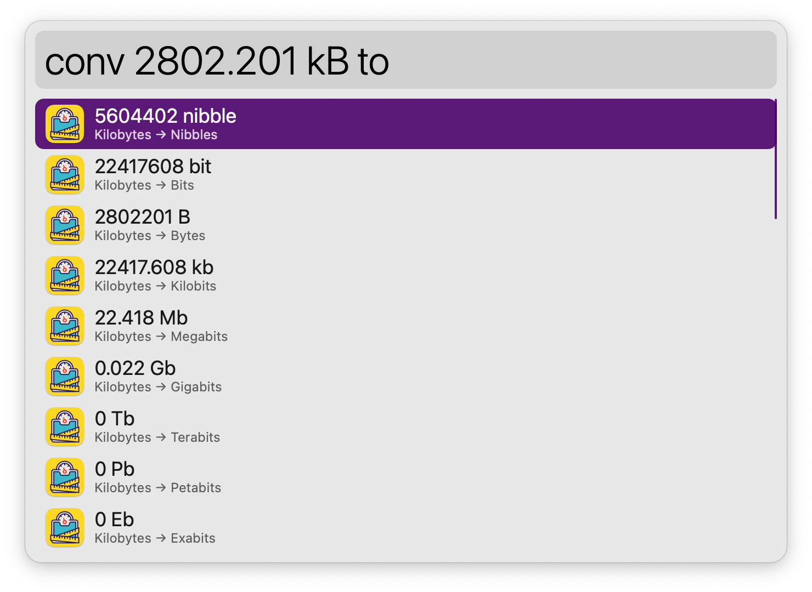
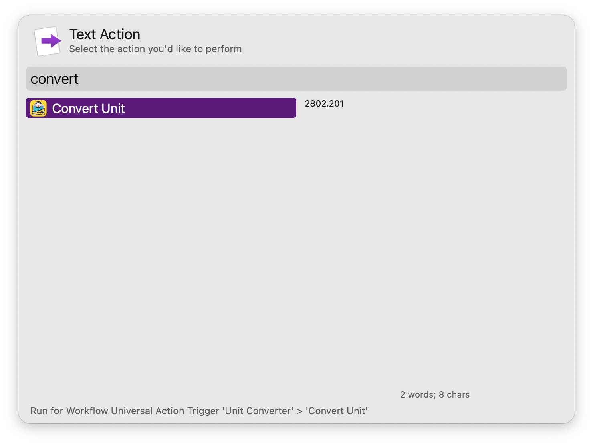

## Usage

Convert dimensions via the `conv` keyword. Type a number to see all available units with their full name and symbol.

Type a unit to filter.

Pressing <kbd>↩</kbd> on a partial match triggers the autocomplete. See all possible conversion targets when matching a unit exactly.

Type further to filter for target units. Connector words (“to”, “as”, “in”) are optional to help with readability.

* <kbd>↩</kbd> Copy result to clipboard.
* <kbd>⌘</kbd><kbd>↩</kbd> Paste result to frontmost app.

Rounding precision and output notation can be set in the Workflow’s Configuration. Output format follows the Number Style in System Settings → General → Language & Region.

Configure the Hotkey or use the Universal Action as shortcuts to convert results from Alfred’s Calculator, Clipboard History, or selected text.

